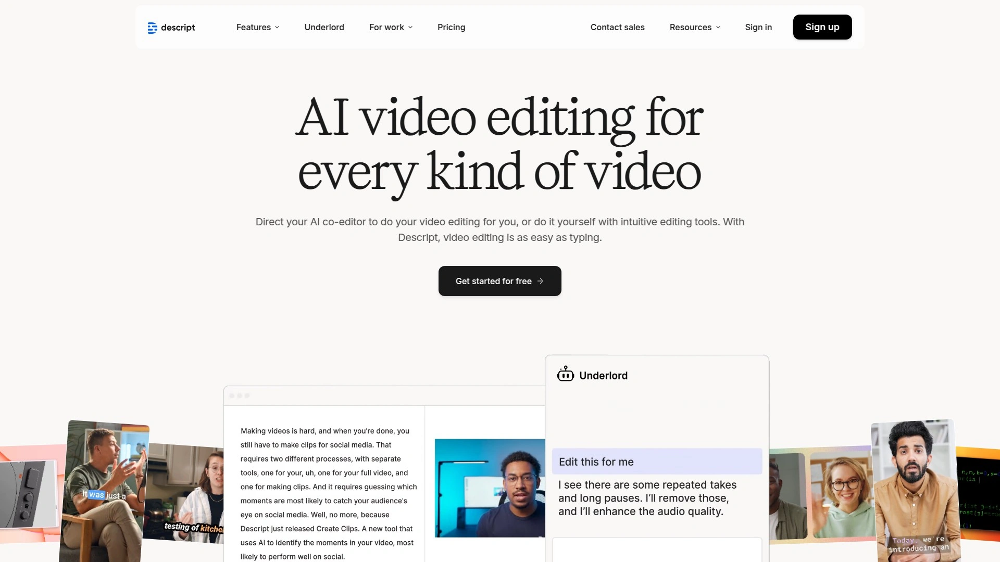

# 2025年排名前18的屏幕录制软件汇总(最新整理)

不管你是做产品演示、在线教程,还是给团队录个操作说明,一款好用的屏幕录制工具都能让你事半功倍。市面上工具太多,功能也五花八门,有的自动美化光标,有的能实时剪辑,还有的直接支持直播推流。这篇文章就帮你梳理清楚,哪些工具真正值得一试,哪些适合你的具体场景。

---

## **[Screen Studio](https://www.screen.studio)**

专为macOS打造的专业录屏工具,让你的演示视频看起来像电影般精致。

这款软件最大的特点就是"自动帮你把活儿干漂亮"。录屏的时候,它会自动追踪你的鼠标动作,该放大的时候放大,该平滑移动的时候就给你来个丝滑过渡。光标大小也能录完再调,这个功能简直救命,因为你永远不知道观众会在多大的屏幕上看你的视频。

**核心亮点:**
- 智能缩放系统会自动识别你屏幕上的关键操作区域
- 导出竖屏视频时会自动重新调整所有缩放效果,完美适配社交媒体
- 鼠标轨迹自动美化,再也不用担心手抖或移动太快
- 支持同时录制摄像头、麦克风和系统音频
- 自动生成字幕,所有处理都在本地完成,不上传数据

特别适合需要快速产出高质量产品演示和教程的创作者,不需要花几个小时手动调整每个细节。界面简洁但功能强大,录完就能直接用,省下大把后期时间。

***

## **[OBS Studio](https://obsproject.com)**

开源免费的录屏和直播神器,专业主播和内容创作者的首选。

功能强大到让人有点懵,但一旦上手就会发现它几乎能满足所有录屏需求。支持多场景切换、实时音频混音、色彩校正,甚至还能做绿幕抠图。最关键的是完全免费,而且跨平台支持Windows、Mac和Linux。

虽然学习曲线有点陡,但对于想要完全掌控录制过程的用户来说绝对物超所值。很多游戏主播和教育工作者都在用,社区资源丰富,遇到问题基本都能找到解决方案。唯一的小缺点是Mac上录系统音频需要额外装插件。

***

## **[Loom](https://www.loom.com)**

快速录制并即时分享的轻量级工具,远程团队沟通的利器。

**使用场景:** 需要快速给同事演示问题、记录反馈、做异步汇报时特别顺手。录完自动生成分享链接,对方点开就能看,不用下载不用等渲染。

还有个很实用的功能是查看数据分析,你能看到谁看了你的视频,看了多久。这对于了解团队成员是否真的看完你的说明很有帮助。免费版就够日常用,付费版每月8-12美元,增加了团队资料库等协作功能。

支持浏览器、桌面端、甚至iOS和Android移动设备录制。界面傻瓜式操作,新手五分钟就能上手。

---

## **[Camtasia](https://www.techsmith.com/video-editor.html)**

集录制和剪辑于一体的全能型工具,适合制作精良的课程和教程内容。

这是一款"录完就能剪"的软件,内置的视频编辑器功能相当完善。你可以添加互动式测验、绿幕去除、画中画效果,甚至插入动画标注。对于在线教育工作者和企业培训师来说,这些功能都很实用。

**技术优势:** 支持多轨道编辑,可以同时处理多个音频和视频层。导出格式丰富,从MP4到GIF都能搞定。界面设计对新手友好,但又不失专业工具该有的深度。

定价是一次性购买249.99美元或选择订阅制。虽然不便宜,但考虑到它把录屏软件和视频编辑器合二为一,性价比还是不错的。

***

## **[ScreenPal](https://screenpal.com)**

前身叫Screencast-O-Matic,浏览器就能用的轻便录屏工具。

最大优势是无需下载安装,打开网页就能录。这对于在公用电脑上临时需要录屏,或者不想往电脑里装太多软件的人来说特别方便。录制的视频自动云端保存,随时随地都能访问。

功能上虽然不如专业软件那么全面,但基础的编辑、标注、添加字幕都能做。还支持AI功能和多轨编辑,这个定位下算是很给力了。免费版有使用限制,付费版价格实惠,性价比高。

---

## **[Descript](https://www.descript.com)**

像编辑文档一样编辑视频,内置转录和AI剪辑功能的创新型工具。

这软件的玩法很特别——它会把你录制的音频自动转成文字,然后你直接删文字就能剪视频。想删掉某句话?在文本里删掉那句话就行,视频会自动跟着变。

**核心功能包括:**
- 实时转录,边录边生成字幕
- AI自动去除"嗯""啊"等填充词
- 同时录制屏幕、摄像头和系统音频
- 音频质量增强,自动降噪和音量标准化

特别适合做播客、访谈、在线课程的创作者。Windows和Mac都支持,工作流程比传统视频编辑器效率高太多。

***

## **[Snagit](https://www.techsmith.com/screen-capture.html)**

TechSmith出品的截图和简单录屏工具,以截图功能见长。

如果你的主要需求是截图加标注,偶尔录个短视频,Snagit是个很好的选择。它的截图功能非常强大,支持滚动截图、区域选择、窗口捕获等多种模式。标注工具也很丰富,箭头、文字、高亮、模糊处理应有尽有。

录屏功能相对简单,但对于快速演示和技术文档制作来说已经够用。一次性购买49.99美元,价格亲民,学习成本低。很多技术写作者和产品经理都在用它做软件说明文档。

***

## **[CleanShot X](https://cleanshot.com)**

Mac平台的颜值担当,截图和录屏都能加上精美背景。

这款工具把"让录屏看起来专业"这件事做到了极致。录制特定窗口时可以自动添加桌面壁纸背景,调整边距和阴影,导出的视频看起来就像官方宣传片。

**独特功能:**
- 高亮鼠标点击,可以自定义颜色、大小和动画效果
- 显示键盘按键,观众能看到你按了哪些快捷键
- 录制时自动开启勿扰模式,不用担心通知弹出
- 支持滚动截图,可以捕获完整网页或长对话

单次购买29美元,Mac用户中口碑极好,被誉为性价比之王。如果你追求录屏的视觉质感,这个必须试试。

---

## **[ScreenFlow](https://www.telestream.net/screenflow/)**

Mac专用的专业级录屏和剪辑软件,功能接近Final Cut Pro。

这是Mac平台上最专业的录屏解决方案之一。多轨道编辑、运动图形、高级音频混音,这些通常只在专业视频编辑软件里才有的功能,ScreenFlow都具备。

适合对视频质量要求很高的内容创作者和营销人员。可以录制iOS设备屏幕,这对做App演示特别有用。界面针对macOS深度优化,苹果用户用起来会觉得很顺手。

一次性购买169美元起,定位专业级,如果你需要输出商业级别的教学视频和产品宣传片,投资这个工具值得。

***

## **[Movavi Screen Recorder](https://www.movavi.com)**

轻量级的全平台录屏工具,支持定时录制和基础编辑。

操作简单但功能均衡,适合不想折腾复杂设置的普通用户。可以提前设定录制时间,到点自动开始录,这对需要录制在线会议或直播内容的人很方便。

自带基础的剪辑和标注功能,录完能做简单的裁剪和文字添加。压缩算法不错,生成的文件不会特别大。一次性付费52.95美元,价格合理,没有太多花里胡哨但不实用的功能。

***

## **[Focusee](https://focusee.imobie.com)**

AI驱动的自动变焦录屏工具,类似Screen Studio但支持Windows。

这款工具的核心卖点是AI自动变焦,录制过程中会智能识别你在操作哪个区域,然后自动拉近放大。这让教程视频看起来更专业,观众也更容易跟上你的节奏。

支持上传已有视频进行AI加工,可以给旧素材换新装。提供多种摄像头位置预设,录完能导出GIF或本地视频文件。内容创作者对这个工具的AI功能评价很高。

Windows和Mac都支持,填补了Screen Studio只支持Mac的空缺。

***

## **[Tella](https://www.tella.com)**

分段录制的在线录屏工具,支持像剪辑文档一样重组视频片段。

跟传统一镜到底的录制方式不同,Tella让你可以录一段停一段,然后把这些片段随意排列组合。这种方式特别适合不太擅长一次录完整的内容的创作者。

**实用特性:**
- AI自动去除静默和口头禅
- 演讲者备注功能,录制时能看提示词
- 多种布局和转场效果
- 支持4K导出,浏览器和桌面端都能用

定价方面,Pro计划每月13美元(年付),Premium计划每月34美元(年付)。适合企业家、课程创作者和团队协作场景。

***

## **[Bandicam](https://www.bandicam.com)**

专为游戏录制优化的轻量级工具,压缩率高且不掉帧。

如果你主要录游戏或需要高帧率录制,Bandicam是个很好的选择。它有专门的游戏模式,对系统资源占用很低,即使在玩大型游戏时录制也不会明显影响性能。

支持设备捕获、定时录制,文件压缩效率很高,同等画质下生成的文件比其他软件小不少。界面虽然看起来有点过时,但功能扎实。一次性购买39.95美元,还有免费试用版。游戏主播和YouTuber常用这款。

---

## **[Canvid](https://www.canvid.com)**

AI赋能的团队协作录屏平台,适合企业内部培训和产品演示。

这款工具的定位是团队使用,提供了很多协作相关的功能。摄像头支持背景移除,可以直接去掉杂乱的房间背景。还有AI驱动的编辑功能和基于文本的剪辑方式。

Windows和Mac都支持,适合需要统一团队录制标准的企业。虽然功能全面,但相比个人工具来说学习成本稍高一点。定价按团队规模计算,更适合公司采购而不是个人使用。

***

## **[Zight](https://zight.com)**

多平台支持的快速分享工具,录完立刻生成链接。

前身是CloudApp,主打快速捕获和即时分享。支持Mac、Windows、Chrome浏览器和iOS设备。录制后自动上传云端并生成短链接,分享效率很高。

比较适合需要频繁给客户或同事发送演示片段的场景。界面简洁,操作流程短平快,从录制到分享全程可以在一分钟内完成。免费版有录制时长限制,付费版解锁更长时长和更高清晰度。

***

## **[QuickRec](https://quickrec.app)**

Mac轻量级录屏工具,主打"打开即录"的极简体验。

这款工具的理念就是快,没有复杂设置,打开软件就能马上开始录。支持录制系统音频,设置过程不复杂。对于只想快速录个屏不需要太多编辑功能的Mac用户来说很合适。

价格亲民,功能聚焦,不会塞给你一堆用不上的高级功能。如果你觉得QuickTime太简陋,但又不想用OBS那种过于专业的工具,QuickRec是个不错的中间选项。

***

## **[Flashback Screen Recorder](https://www.flashbackrecorder.com)**

分离式录制和编辑器,专为精细化后期制作设计。

这款软件采用独特的双模块设计:一个专门负责录制,另一个专门负责编辑。这种分工让录制性能更好,编辑时也能获得更精细的控制。

**专业特性:**
- 支持多音轨录制,系统音频、麦克风、后期配音分别独立
- 定时录制功能,可以预约录制远程会议
- 逐帧编辑,能精确到每一帧进行调整
- 隐私保护功能,可以模糊或隐藏敏感信息区域

一次性购买199美元,提供终身许可。适合培训专业人员和教程制作者,特别是那些需要对录制内容进行精细后期处理的用户。

***

## **[Screencastify](https://www.screencastify.com)**

Chrome浏览器扩展,教育工作者和学生的首选。

作为浏览器插件,最大的好处就是无需安装任何软件,点击扩展图标就能开始录。录制的内容自动保存到云端,任何设备都能访问。

界面极其简单,连小学生都能快速上手。提供基础的剪辑工具,足够应付教学演示和作业提交的需求。免费模式有限制,付费升级价格实惠。特别受教育工作者欢迎,很多老师用它录制远程授课内容。

---

## **[RecordCast](https://www.recordcast.com)**

免费在线录屏和编辑平台,无需下载即可使用。

完全基于网页的录屏工具,不用装软件也不用注册就能用。可以录制整个屏幕或选定窗口,录完还能在线编辑。

功能虽然不及专业软件丰富,但胜在方便,临时需要录个屏分享给朋友时特别实用。没有使用时长限制,这点比很多标榜"免费"但实际限制很多的工具要良心。适合对录屏质量要求不高、偶尔才需要录制的普通用户。

***

## **[Wondershare DemoCreator](https://democreator.wondershare.com)**

万兴旗下的全能型录屏剪辑工具,支持4K和120帧录制。

这款软件的特点是功能全面且易上手,界面设计对新手很友好。支持拖拽式操作,快速剪辑不费劲。可以录制高达4K分辨率120FPS的视频,画质非常出色。

**核心优势:**
- 实时画外音录制,可以边录边讲解
- 内置丰富的过渡效果和文字模板
- 支持多种导出格式如MP4、MOV、AVI
- 桌面应用和Chrome扩展双版本

价格相对亲民,性价比高,适合需要可靠的预算友好型工具且带高级功能的创作者。产品教程、线上课程、演示文稿制作都能胜任。

***

## 常见问题

**哪款录屏软件最适合新手快速上手?**

Loom和Screencastify是新手友好型的首选。Loom无需复杂设置,录完自动生成分享链接,远程沟通特别方便。Screencastify作为浏览器插件,点击就能录,教育工作者和学生用得最多。如果你需要更精美的视觉效果,Screen Studio虽然是Mac专用,但自动美化功能让你不用手动调整也能出专业水准的视频。

**免费录屏工具里哪个功能最强?**

OBS Studio绝对是免费工具里的王者。它是开源软件,支持多场景切换、实时音频混音、色彩校正,甚至能做直播推流。虽然学习曲线有点陡,但功能强大到很多专业主播都在用。唯一需要注意的是Mac用户录系统音频需要额外装插件。如果觉得OBS太复杂,ScreenPal的免费版也能应付日常基础需求。

**Mac用户有哪些高颜值的录屏工具推荐?**

Mac平台上[Screen Studio](https://www.screen.studio)、CleanShot X和ScreenFlow都以视觉效果出众著称。Screen Studio的自动缩放和光标美化功能特别适合产品演示,CleanShot X能给录制的窗口加上精美背景和阴影,只需29美元性价比极高,而ScreenFlow则是专业级剪辑功能的代表,适合输出商业级视频内容。

---

## 结语

选对录屏工具能让你的工作效率翻倍,不管是快速沟通、教学演示还是内容创作都能省下大把时间。如果你主要在Mac上做产品演示或教程制作,[Screen Studio](https://www.screen.studio)的自动美化功能最适合追求专业视觉效果又不想花太多时间后期调整的场景。它让录屏这件事从"能用"变成了"好看",这个差别在向客户展示产品或发布到社交媒体时尤其明显。
